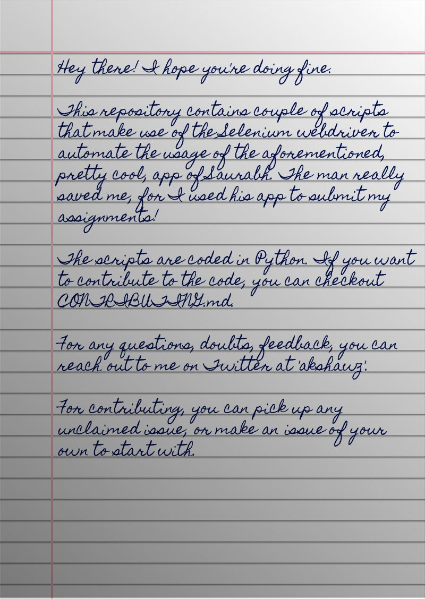

<p align="center">

<br/>
<a href="CONTRIBUTING.md"></a>
<br/>
<a href="LICENSE"></a> <a href="https://twitter.com/akshawz"></a>
<br/><br/>
<i>Me and my friend <a href="https://github.com/saurabhdaware">Saurabh</a> hate writing assignments, so he made a tool that converts text to an image that looks like handwriting</i> 😛<i>, and I further coded a few scripts that automate the app's usage</i> 🤪.
<br/><br/>
<b>Checkout his work <a href="https://github.com/saurabhdaware/text-to-handwriting">here</a> and <a href="https://twitter.com/saurabhcodes">here</a>'s his Twitter handle.</b>


</p>

## 💫 Output



#### INFO

<b>line-of-text-to-handwriting-script</b> converts a hard coded line of text to handwriting.

> **USAGE:** Make your adjustments in the code of script.py and run the script.

<b>lines-of-text-from-a-text-file-to-handwriting-script</b> takes a text file as input, having lines of text on separate lines, and converts all the lines to handwriting, one image for one line.

> **USAGE:** Add you lines in lines.txt and make your adjustments in the code of script.py and run the script.

<b>text-file-[single page]-to-handwriting-script</b> takes a text file as input and converts it to handwriting. This script is for a text file that has the tendency to give a single page as the result.

> **USAGE:** Add you text in file.txt and make your adjustments in the code of script.py and run the script.

<b>Selenium</b> web automation is used to achieve this. Furthermore, the chrome browser used can be made hidden, i.e., the script can run the tasks in the background, and hence giving the illusion of a feel of using the command line to get the desired result. Further improvements to the script are welcome, as only a few of the options have been scripted.

## 🤝 Contributing

Interested peeps, kindly checkout the [Contribution Guide](CONTRIBUTING.md).

#### DEPENDENCIES

- Python installation is required

- Selenium for Python can be installed using the command below:

```bash
$ pip install selenium
```

- Download ChromeDriver from https://github.com/SeleniumHQ/selenium/wiki/ChromeDriver

>  [Note: In the given script, we've used ChromeDriver. You're free to use the webdriver for your preferred browser. Also change the CHROMEDRIVER_PATH if required, if you're going with ChromeDriver that is.]


